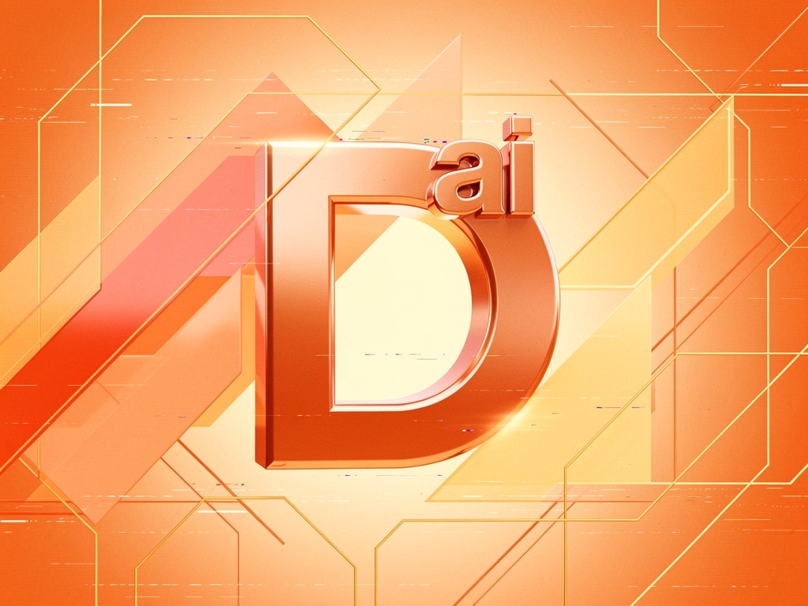

# DDD2 — Documentation-Driven Development for AI (JetBrains Plugin)

<div align="center">
    
</div>

[]([https://plugins.jetbrains.com](https://plugins.jetbrains.com/plugin/31829-documentation-first--ddd2))
[](LICENSE)
[](https://documentationfirst.ai)

> Make Documentation-Driven Development v2 a first-class AI citizen of your IDE.

Works with **IntelliJ IDEA, WebStorm, Rider, PyCharm, GoLand** — any JetBrains IDE.

---

## Features

| Action | Description |
|--------|-------------|
| **DDD: Initialize Project** | Scaffolds `.ai_context/` with templates for the detected stack |
| **DDD: New Feature Context** | Creates `features/{name}/specs-functional.md`, `specs-technical.md`, `DONE.md` |
| **DDD: New Migration Plan** | Creates `migrations/{name}/migration-plan.md`, `MIGRATION_DONE.md` |
| **DDD: View DONE.md** | Opens the nearest `DONE.md` in the editor |

**DDD Tool Window** — right sidebar panel to navigate all DDD files with icons per type.

**Auto-detection** — on project open, detects whether `.ai_context/` is present and offers to initialize.

**Stack detection** — Angular, React, Vue, Spring Boot, Python, Rust, Go, Generic.

---

## Getting Started

### 1. Install

From the JetBrains Marketplace (when published), or install the `.zip` locally:

```
Settings → Plugins → ⚙️ → Install Plugin from Disk → select ddd-plugin-jetbrains-1.0.0.zip
```

### 2. Open a project

The plugin auto-detects your stack and shows a notification:
- ✅ `DDD Ready` if `.ai_context/` found
- ⚠️ `Initialize?` if not

### 3. Initialize

```
Right-click → DDD → DDD: Initialize Project
```

Or click **Initialize** in the startup notification.

### 4. Create your first feature context

```
Right-click → DDD → DDD: New Feature Context → "authentication"
```

Creates:
```
.ai_context/features/authentication/
├── specs-functional.md   ← edit this (PO / dev)
├── specs-technical.md    ← edit this (dev)
└── DONE.md               ← filled by the AI after completion
```

---

## Development

### Prerequisites

- JDK 17+
- IntelliJ IDEA (for running the plugin sandbox)

### Build

```bash
./gradlew buildPlugin
# → build/distributions/ddd-plugin-jetbrains-1.0.0.zip
```

### Run in sandbox

```bash
./gradlew runIde
# Opens a sandboxed IntelliJ instance with the plugin installed
```

### Tests

```bash
./gradlew test
```

### Publish to Marketplace

```bash
PUBLISH_TOKEN=... ./gradlew publishPlugin
```

---

## Project Structure

```
src/main/kotlin/ai/documentationfirst/ddd/
├── startup/
│   └── DddProjectStartupActivity.kt   ← Auto-detection on project open
├── detector/
│   └── DddDetector.kt                 ← Stack & DDD folder detection
├── templates/
│   └── TemplateProvider.kt            ← MD templates + scaffold logic
├── actions/
│   └── DddActions.kt                  ← All 4 actions (Init, Feature, Migration, ViewDone)
├── toolwindow/
│   └── DddToolWindowFactory.kt        ← Right sidebar panel + tree
└── notifications/
    └── DddNotifications.kt            ← Balloon notifications

src/test/kotlin/ai/documentationfirst/ddd/
├── DddDetectorTest.kt
└── TemplateProviderTest.kt

src/main/resources/META-INF/
└── plugin.xml                         ← Plugin descriptor
```

---

## Roadmap

| Version | Features |
|---------|----------|
| **v1.0** | Detection, scaffolding, tool window, actions, templates (Angular, Spring Boot, Python, Rust, Go, Generic) |
| v1.1 | JetBrains AI context injection (when API stabilizes) |
| v1.2 | More stack templates (React, Vue, Django, Actix) |
| v1.3 | DONE.md diff viewer |
| v2.0 | DDD score per project, AI session recap |

---

## Links

- 🌐 [documentationfirst.ai](https://documentationfirst.ai)
- 📖 [DDD Manifesto](https://github.com/documentationfirst/manifesto)
- 🔌 [IntelliJ Plugin](https://github.com/documentationfirst/plugin-intellij)
- 🔵 [VSCode Plugin](https://github.com/documentationfirst/plugin-vscode)

---

*MIT License — Documentation First*

